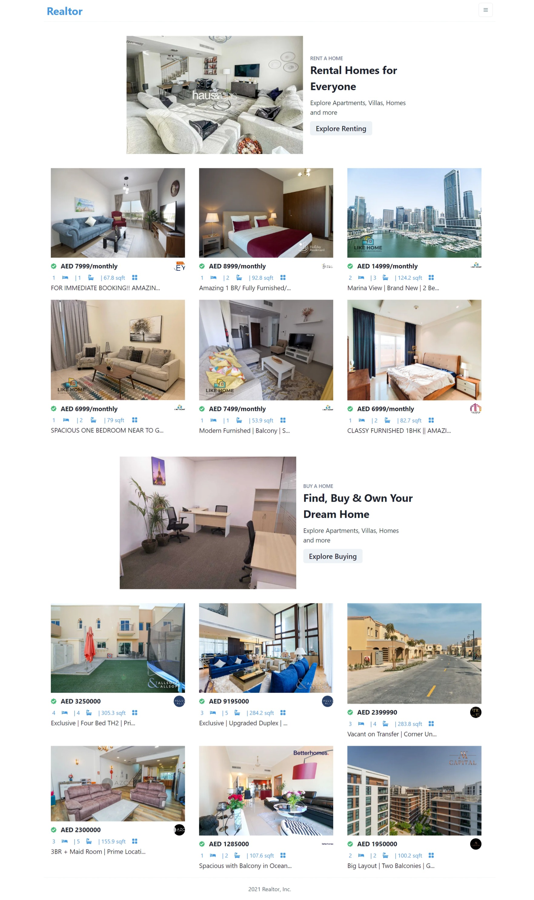
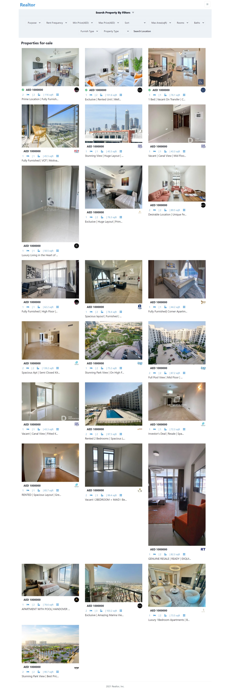
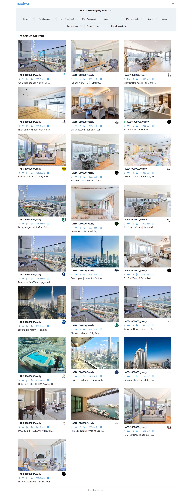
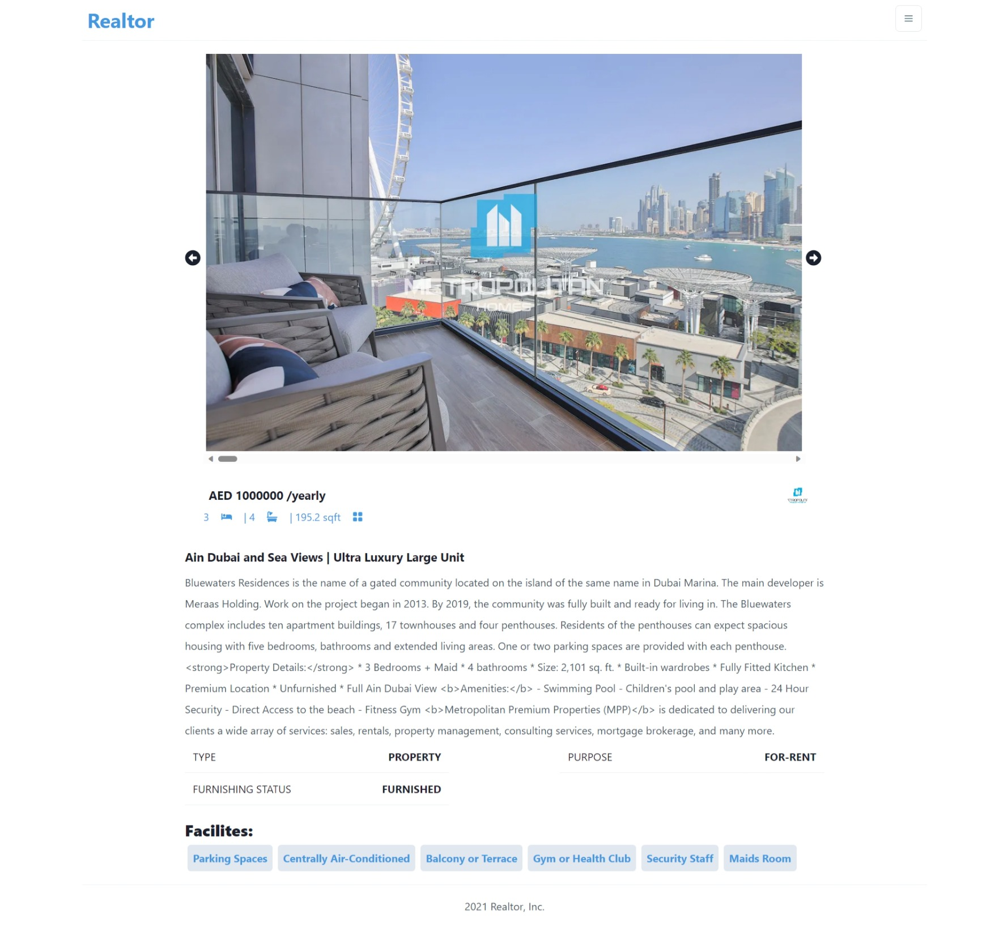

# Real Estate Website
This design is inspired by the work of [JavaScript Mastery](https://www.youtube.com/@javascriptmastery). Click [here](https://youtu.be/y47gYvXchXM?si=puQrHYCULxsgoRgk) to watch the video.

## Technologies
This web page was made with the following technologies:
- HTML5
- CSS3
- JavaScript
- React
- React Icons
- Next.js
- Chakra UI
- Framer Motion
- Vercel

## Pages
This web page contains 7 sections: **Home**, **Search**, **Properties for sale**, **Properties for rent** and **Property details**.

### Home
#### In this home section, you will be able to see all the properties available for purchase or rent. Also, in the top right corner, you will find a dropdown menu that will allow you to access the different sections of the page.

### Search
#### In this view, you will be able to search for the available properties on the page, applying filters according to your preferences. You will be able to filter by the number of bedrooms, bathrooms, price, and other criteria.

### Properties for sale
#### In this view, you will have access to all the properties that are offered for sale, and you will be able to search them by a custom filter.

### Properties for rent
#### In this section, you will be able to see all the properties available for rent, and you will be able to filter them according to your search criteria.

### Property details
#### Furthermore, when you click on a property that you like, you will be redirected to another page where you can see more details about it, such as more images, a detailed description, the property type, the sale or rent status, and the amenities it offers, such as balcony, pool, air conditioning, etc.

